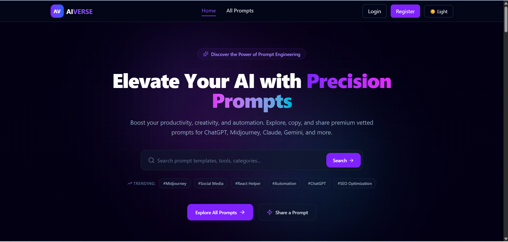

# 🌌 AIverse - AI Prompt Sharing & Marketplace Platform

AIverse is a modern full-stack AI prompt marketplace where users can discover, share, bookmark, and manage AI prompts for tools like ChatGPT, Gemini, Claude, and Midjourney. The platform features role-based authentication, premium subscriptions, moderation workflows, analytics, and a responsive user interface.

---

## 🔗 Live Links

- 🌐 **Client:** https://aiverse-client-six.vercel.app
- ⚙️ **Server:** https://aiverse-server-zeta.vercel.app
- 💻 **Client Repository:** https://github.com/SSLiza/aiverse-client
- 🖥️ **Server Repository:** https://github.com/SSLiza/aiverse-server

---

## 📸 Project Screenshot

<p align="center">
  
</p>

> Replace the image above with a screenshot of your homepage or dashboard.

---

## 🚀 Features

- 🔐 Secure Authentication with Email/Password & Google Login
- 👥 Role-Based Dashboard (User, Creator & Admin)
- 💳 Stripe Premium Subscription System
- 📝 AI Prompt Marketplace with Search, Filter & Sorting
- 📌 Bookmark & Review System
- ⭐ Dynamic Rating & Review Aggregation
- 📊 Creator Analytics Dashboard with Recharts
- 🛡️ Admin Prompt Moderation
- 🌙 Light & Dark Theme Support
- 📱 Fully Responsive Design

---

## 🛠️ Tech Stack

### Frontend

- Next.js (App Router)
- React
- TypeScript
- Tailwind CSS
- HeroUI
- DaisyUI
- Framer Motion
- Recharts

### Backend

- Node.js
- Express.js
- MongoDB
- JWT Authentication
- Stripe API

---

## 📦 Dependencies

### Client

- next
- react
- tailwindcss
- heroui
- daisyui
- framer-motion
- axios
- react-hook-form
- react-toastify
- recharts
- lucide-react
- @stripe/react-stripe-js
- @stripe/stripe-js

### Server

- express
- mongodb
- mongoose
- jsonwebtoken
- cors
- dotenv
- stripe

---

## ⚙️ Environment Variables

### Server (.env)

```env
PORT=5000
DB_URI=your_mongodb_connection_string
JWT_SECRET=your_jwt_secret
STRIPE_SECRET_KEY=your_stripe_secret_key
CLIENT_URL=http://localhost:3000
```

### Client (.env.local)

```env
NEXT_PUBLIC_BASE_URL=http://localhost:5000
NEXT_PUBLIC_STRIPE_PUBLISHABLE_KEY=your_publishable_key
```

---

# 💻 Run Locally

### 1️⃣ Clone the repositories

```bash
git clone https://github.com/SSLiza/aiverse-client.git
git clone https://github.com/SSLiza/aiverse-server.git
```

---

### 2️⃣ Install dependencies

Client

```bash
cd aiverse-client
npm install
```

Server

```bash
cd aiverse-server
npm install
```

---

### 3️⃣ Configure Environment Variables

Create the required `.env` and `.env.local` files using the examples above.

---

### 4️⃣ Start the Server

```bash
cd aiverse-server
npm run dev
```

---

### 5️⃣ Start the Client

```bash
cd aiverse-client
npm run dev
```

---

### 6️⃣ Open the Application

```
http://localhost:3000
```

---

## 📂 Project Structure

```
aiverse-client/
aiverse-server/
```

---

## 🎯 Future Improvements

- 🤖 AI-powered prompt recommendations
- 🔔 Real-time notifications
- 📤 Export prompts as PDF, JSON & CSV
- ❤️ Like & Follow creators
- 💬 Real-time chat between creators and users

---

## 👨‍💻 Developer
* **Name:** Shajeda Sultana
* **Email:** [shajedasultanaliza2002@gmail.com](mailto:shajedasultanaliza2002@gmail.com)